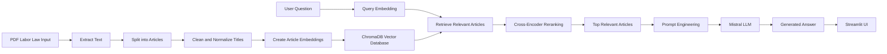

# AI-Powered Labor Law Chatbot

## Overview

This AI chatbot answers questions about Egyptian labor law using a Retrieval-Augmented Generation (RAG) architecture. It extracts legal articles from a labor law PDF, stores them in a vector database, retrieves the most relevant articles for each user question, and generates grounded answers using a large language model.

## Features

- Extracts text from Egyptian labor law PDF documents.
- Splits legal text into structured articles.
- Cleans and normalizes article titles.
- Generates semantic embeddings for article retrieval.
- Stores article vectors and metadata in ChromaDB.
- Uses hybrid retrieval with semantic search and keyword matching.
- Applies cross-encoder reranking for better relevance.
- Generates structured answers using Mistral-7B-Instruct.
- Supports Arabic and English responses through a Streamlit interface.

## System Workflow

### Step 1: Load Source Document

- Input: Egyptian Labor Law PDF.
- Extract text from the PDF using `pypdf`.

### Step 2: Text Processing

- Split the extracted PDF text into legal articles.
- Clean extracted text.
- Normalize article titles.
- Structure article metadata.

### Step 3: Embedding Generation

- Model: `BAAI/bge-base-en-v1.5`.
- Generate vector embeddings for each legal article.

### Step 4: Vector Storage

- Store embeddings, article text, and metadata in ChromaDB.
- Use a persistent vector database for fast retrieval.

### Step 5: User Query Processing

- Receive a user question.
- Convert the question into an embedding vector.
- Perform semantic similarity search.
- Apply keyword matching.
- Combine semantic and keyword scores using hybrid retrieval.

### Step 6: Reranking

- Model: `cross-encoder/ms-marco-MiniLM-L-6-v2`.
- Rerank retrieved legal articles to improve relevance.

### Step 7: LLM Answer Generation

- Model: `Mistral-7B-Instruct-v0.2`.
- Use only the retrieved legal context.
- Generate clear, structured answers.
- Support multilingual response behavior.

### Step 8: Frontend

- Build the chatbot interface with Streamlit.
- Accept user questions through a text input.
- Display generated answers in Arabic or English.

### Step 9: Deployment

- Run the application with Streamlit.
- Expose the local app using Ngrok when running from Google Colab.

## Architecture Workflow

1. PDF Labor Law Input
2. Extract Text
3. Split into Articles
4. Clean and Normalize Titles
5. User Question
6. Query Embedding
7. Create Article Embeddings
8. Store in ChromaDB
9. Retrieve Relevant Articles
10. Cross-Encoder Reranking
11. Select Top Articles
12. Prompt Engineering
13. Mistral LLM Inference
14. Generate Answer
15. Streamlit UI Display



## Tech Stack

- Python
- pypdf
- NumPy
- scikit-learn
- Sentence Transformers
- Transformers
- ChromaDB
- Streamlit
- PyTorch
- Mistral-7B-Instruct
- Ngrok

## Main Models

| Purpose | Model |
| --- | --- |
| Article embeddings | `BAAI/bge-base-en-v1.5` |
| Reranking | `cross-encoder/ms-marco-MiniLM-L-6-v2` |
| Answer generation | `Mistral-7B-Instruct-v0.2` |

## Installation

Install the required Python libraries:

```bash
pip install pypdf sentence-transformers transformers numpy scikit-learn chromadb bitsandbytes accelerate streamlit pyngrok
```

## How to Run

### Google Colab

1. Upload the Egyptian Labor Law PDF.
2. Update the PDF path in the code:

```python
file_path = "/content/Labor-law (1).pdf"
```

3. Run the setup and installation cells.
4. Extract the PDF text.
5. Split and clean the legal articles.
6. Generate article embeddings.
7. Store the articles in ChromaDB.
8. Load the Mistral model.
9. Run the Streamlit application.
10. Start Ngrok and open the public URL.

### Local Machine

The current Python file was exported from Google Colab, so local usage may require separating the Streamlit section into an `app.py` file.

1. Create and activate a virtual environment.
2. Install the required libraries.
3. Replace Colab paths such as `/content/...` with local paths.
4. Run the Streamlit app:

```bash
streamlit run app.py
```

## Example Questions

- What are sick leave rights?
- What are annual leave rights?
- What are the rules for employee termination?
- What are the employer obligations?
- What are the working hour limits?

## Important Notes

- The project is designed around a Google Colab workflow.
- Some commands in the Python file use notebook syntax such as `!pip install`.
- Mistral-7B may require a GPU and enough memory to run efficiently.
- The quality of the chatbot depends on the quality of PDF text extraction.
- API keys and Ngrok tokens should not be hard-coded in public code.

## Disclaimer

This chatbot is an educational AI assistant. It provides answers based on retrieved labor law text and should not be considered official legal advice.
